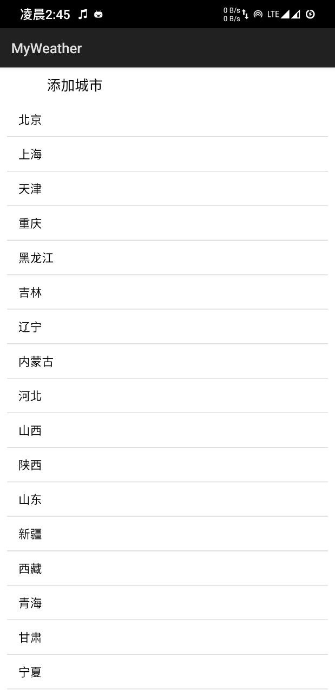
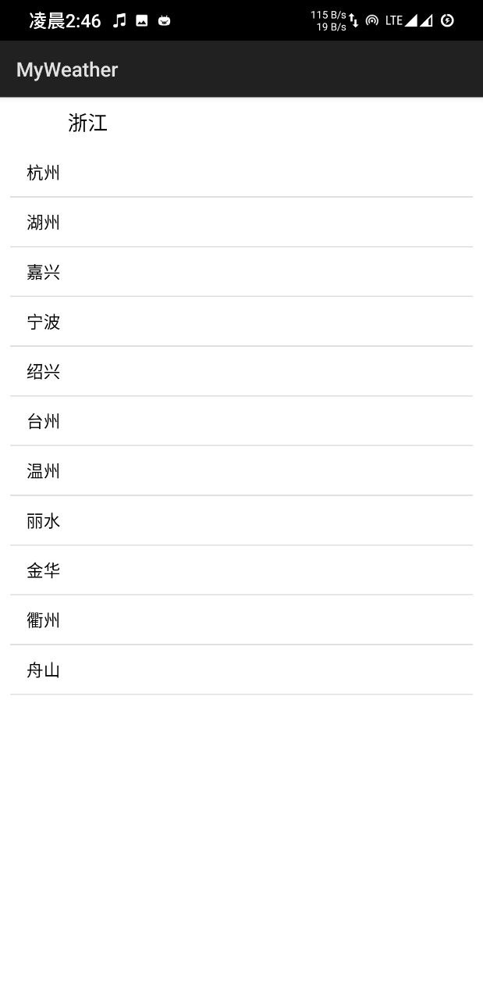
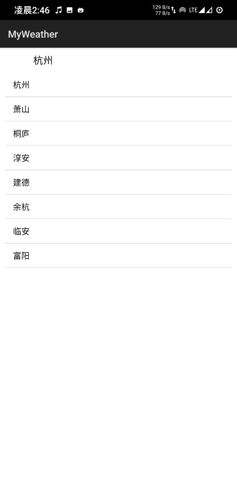
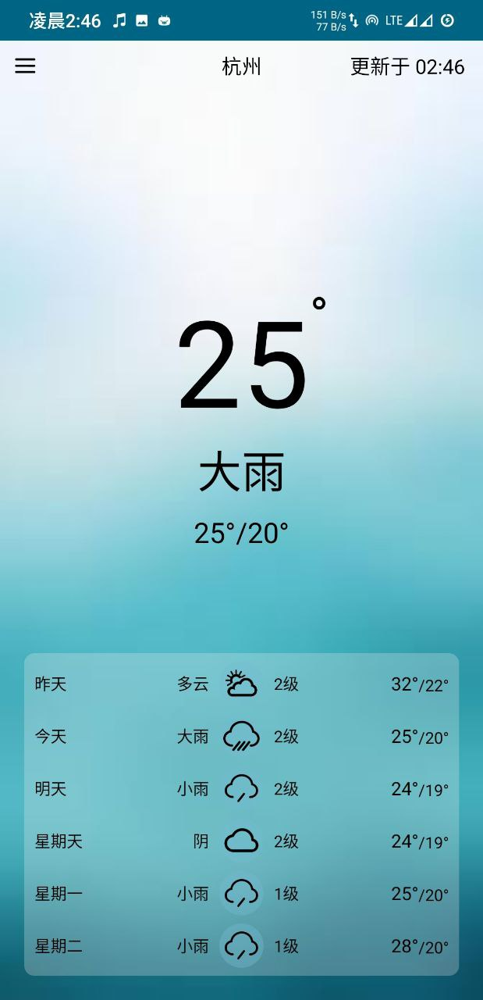
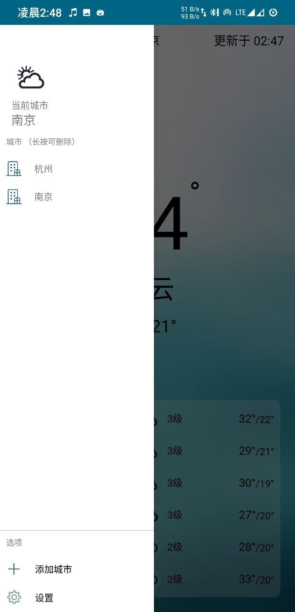
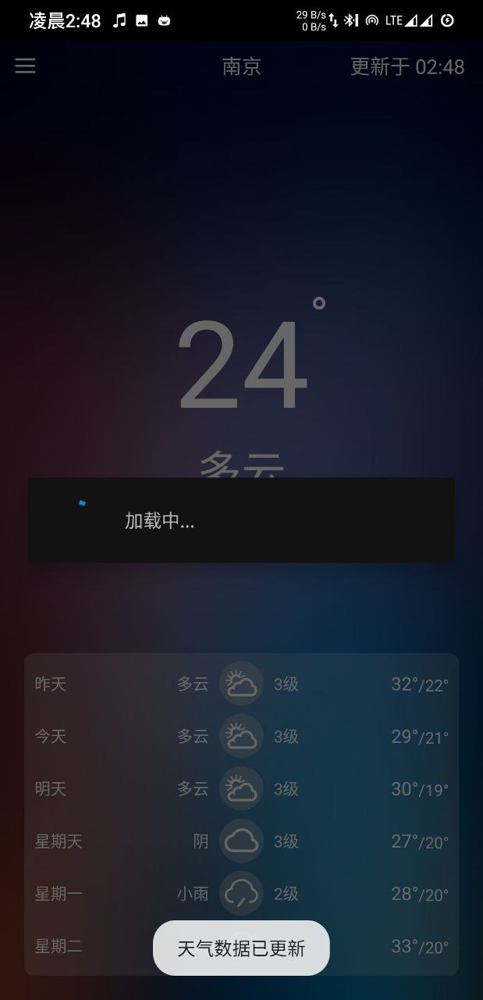
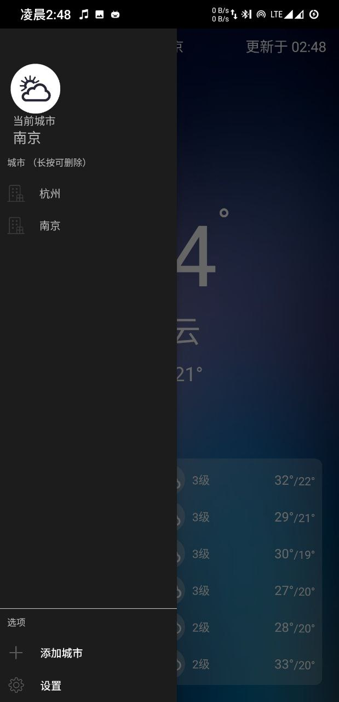

# MyWeather

A Simple Weather App for Android

## 演示

首次运行app，进入城市选择界面。假设选择浙江 > 杭州 > 杭州

选择后，进入显示天气的主界面

从左侧右滑，或者点击左上按钮，呼出左侧抽屉菜单

在这里，点击添加城市，添加另一个城市-南京后

切换系统为夜间模式

查看设置

关闭夜间模式，切换后台刷新间隔

添加桌面小部件

